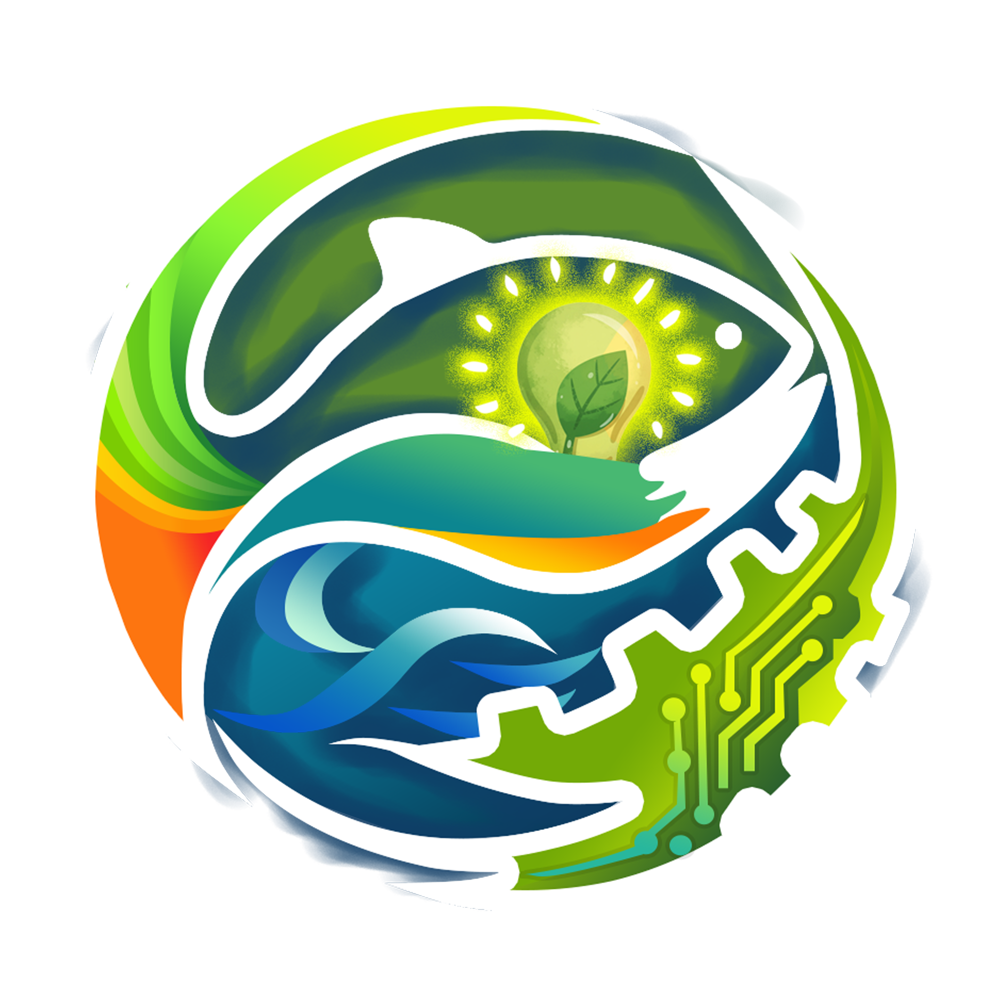

<!DOCTYPE html>
<html lang="id">
<head>
    <meta charset="UTF-8">
    <meta name="viewport" content="width=device-width, initial-scale=1.0, viewport-fit=cover">
    <title>CARA'DE Command Center</title>
    
    <!-- Meta untuk WhatsApp Preview agar tidak ada peringatan -->
    <meta property="og:title" content="CARA'DE Command Center">
    <meta property="og:description" content="Sistem Informasi Digital Desa Tinggimae">
    <meta property="og:type" content="website">

    <!-- Dependencies -->
    
    <link rel="stylesheet" href="https://unpkg.com/leaflet@1.9.4/dist/leaflet.css" />
    
    <link href="https://fonts.googleapis.com/css2?family=Plus+Jakarta+Sans:wght@400;600;800&family=Space_Grotesk:wght@700&display=swap" rel="stylesheet">

    
</head>
<body>

    
    
ᨌᨑᨉᨙ

    
CARA'DE

<header class="sticky top-0 z-[100] glass border-b border-green-200 px-4 py-3 shadow-sm">
    

        

            

                
                
                

                

                    CARA'DE
                    ᨌᨑᨉᨙ
                

            

            <button class="bg-green-100 p-2 rounded-full text-xs shadow-sm">🔔</button>
        

        <nav class="flex gap-2 overflow-x-auto no-scrollbar pb-1">
            <button onclick="showTab('tab-modul')" id="btn-tab-modul" class="nav-btn active flex-none px-6 py-2 rounded-full text-[10px] font-black uppercase italic border border-green-100">Modul Hub</button>
            <button onclick="showTab('tab-cuaca')" id="btn-tab-cuaca" class="nav-btn flex-none px-6 py-2 rounded-full text-[10px] font-black uppercase italic border border-green-100">Cuaca & AI</button>
            <button onclick="showTab('tab-tim')" id="btn-tab-tim" class="nav-btn flex-none px-6 py-2 rounded-full text-[10px] font-black uppercase italic border border-green-100">Personil</button>
            <button onclick="showTab('tab-lokasi')" id="btn-tab-lokasi" class="nav-btn flex-none px-6 py-2 rounded-full text-[10px] font-black uppercase italic border border-green-100">Lokasi Maps</button>
        </nav>
    

</header>

<main id="tab-modul" class="tab-content active w-full px-4 py-6 max-w-7xl mx-auto">
    

        <button onclick="setModule(1)" class="flex-none w-32 p-3 glass rounded-2xl text-[9px] font-black uppercase border-b-4 border-orange-500 italic">01 APPARE'</button>
        <button onclick="setModule(2)" class="flex-none w-32 p-3 glass rounded-2xl text-[9px] font-black uppercase border-b-4 border-green-600 italic">02 MAGGOT</button>
        <button onclick="setModule(3)" class="flex-none w-32 p-3 glass rounded-2xl text-[9px] font-black uppercase border-b-4 border-blue-500 italic">03 PANGE'BA</button>
        <button onclick="setModule(4)" class="flex-none w-32 p-3 glass rounded-2xl text-[9px] font-black uppercase border-b-4 border-emerald-600 italic">04 PATTAPPARANG</button>
        <button onclick="setModule(5)" class="flex-none w-32 p-3 glass rounded-2xl text-[9px] font-black uppercase border-b-4 border-purple-500 italic">05 PA'BULOANG</button>
    

    

</main>

<main id="tab-cuaca" class="tab-content w-full px-4 py-6 max-w-4xl mx-auto space-y-6">
    

        

            

                <h2 id="live-temp" class="text-6xl font-black italic tracking-tighter">--°C</h2>
                
Mencari Satelit...

            

            

                
Desa Tinggimae

                
--:--

            

        

        

            

Kelembapan

--%

            

Angin

-- km/h

            

Indeks UV

--

        

    

    

        <h3 class="text-[10px] font-black uppercase italic mb-4">Cara'de AI Assistant</h3>
        

            
Halo! Ada yang bisa saya bantu terkait modul?

        

        

            <input id="ai-input" type="text" placeholder="Tanya sesuatu..." class="flex-1 bg-transparent px-4 text-[11px] outline-none">
            <button onclick="askAI()" class="bg-green-600 text-white w-10 h-10 rounded-full">➜</button>
        

    

</main>

<main id="tab-tim" class="tab-content w-full px-4 py-6 max-w-7xl mx-auto">
    

        
Dosen Pendamping

        <h3 class="text-xl font-black italic">Husnul Mubarak, S.TP., M.Si</h3>
    

    

</main>

<main id="tab-lokasi" class="tab-content w-full px-4 py-6 max-w-5xl mx-auto">
    

</main>

<footer class="py-10 text-center opacity-30 text-[9px] font-black tracking-[1em]">CARA'DE 2026</footer>

</body>
</html>
